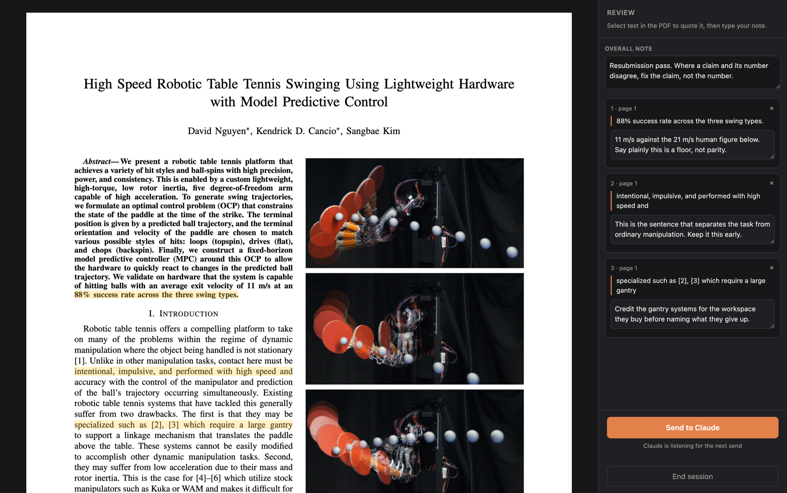
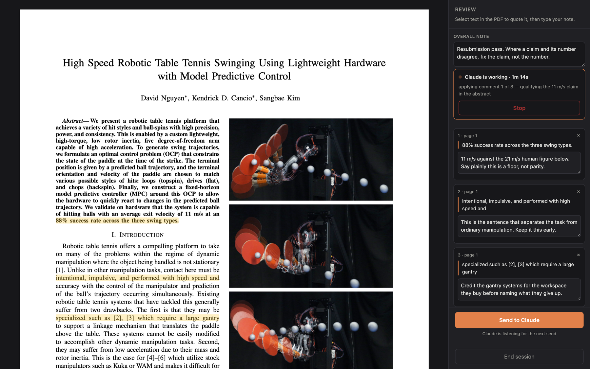

# overleaf-review

A Claude Code skill for marking up a compiled paper by hand and having the notes
applied to the LaTeX source.

You highlight passages in the rendered PDF and type a note on each. Claude finds
each quoted passage in the `.tex` source, makes the edit, recompiles, and the
page reloads on the new PDF. Then it waits for your next pass.



<sub>A pass over “Whole-Body Model Predictive Control for Spin-Aware Quadrupedal Table Tennis.”</sub>

> **Works directly against Overleaf.** Paste a project URL and the skill clones
> it over Overleaf's Git bridge, builds it locally, and pushes your edits back.
> No VS Code and no browser extension. It also runs unchanged on any local LaTeX
> repo that already builds.

## Why not just comment in a PDF reader

A PDF annotation lives in the build output. Every recompile throws it away, and
nothing connects a sticky note to the line of `.tex` that produced the text
underneath it. This keeps the comment attached to the quoted text rather than to
a page coordinate, so the match survives a reflow, and it hands the batch to
something that can make the edit.

## Requirements

**An Overleaf account with Git integration.** Overleaf exposes each project over
a Git bridge, and that is the only interface this skill uses. It is a paid
feature on Overleaf's own hosting — Standard and Professional, and many
institutional licences — so check that your account has it before going further.
Overleaf publishes no API for listing projects or for compiling, so neither is
used here.

Create a token in Overleaf under **Account Settings -> Git integration**. One
token covers every project you own; you store it once.

Also needed:

- **Claude Code**, since the skill is a set of instructions it follows.
- **Python 3.9+**, standard library only. No packages to install.
- **A LaTeX toolchain with `latexmk`** on your `PATH`. MacTeX or TeX Live give
  you both. `latexmk` matters: a fresh clone carries no `.bbl`, and running
  `pdflatex` twice by hand leaves every citation undefined while still exiting
  zero, so you get a PDF full of `[?]` that looks like a broken install.
- **macOS**, for now. The token is stored in the login keychain via `security`.
  Everything else is portable; a Linux port needs a different credential store.
- **A browser with network access on first load.** The viewer pulls PDF.js from
  a CDN. Nothing else leaves the machine: the server binds `127.0.0.1`, and your
  PDF and comments never go anywhere.

Already have the paper as a local Git repo that builds? Skip the Overleaf setup
entirely and run `/pdf-review` in it.

## Install

```bash
git clone https://github.com/davidhnguyen2000/overleaf-review.git \
  ~/.claude/skills/pdf-review
```

Claude Code takes the skill name from the directory, so keep it `pdf-review`
unless you also change the `name:` field in `SKILL.md`.

Add the Stop hook to `~/.claude/settings.json`. It is what flips the viewer out
of its working state when a turn actually ends — without it the spinner never
stops:

```json
{
  "hooks": {
    "Stop": [
      {
        "hooks": [
          {
            "type": "command",
            "command": "python3 ~/.claude/skills/pdf-review/turn_end.py 2>/dev/null || true",
            "timeout": 5
          }
        ]
      }
    ]
  }
}
```

### Connect Overleaf

Store your token once. It goes into the login keychain, not into any file or
remote URL:

```bash
python3 ~/.claude/skills/pdf-review/overleaf.py login --token olp_xxxxxxxx
```

Already using a repo with the token baked into its Git remote? Move it into the
keychain and strip the URL:

```bash
python3 ~/.claude/skills/pdf-review/overleaf.py secure ~/path/to/that/repo
```

Then open a project. Use the **editor** URL from your browser's address bar:

```bash
python3 ~/.claude/skills/pdf-review/overleaf.py open \
  https://www.overleaf.com/project/<24-hex-id> --name mypaper
```

It clones, remembers the name, and prints the directory. Next time `open
mypaper` is enough. A `/read/` or share link will not work — it carries a share
token rather than a project id, and the Git bridge cannot use it.

Check that it builds before involving Claude:

```bash
python3 ~/.claude/skills/pdf-review/overleaf.py build --dir <printed-dir>
```

You want a page count and `undefined citations: 0`. If citations are undefined,
your bibliography style is probably not in the repo; `overleaf.py vendor-bst
--dir <dir>` copies `IEEEtran.bst` in from your TeX installation, which also
removes the last build input that can differ between your machine and
Overleaf's.

### Migrating from Overleaf Connect

Nothing to undo. The extension only ever wrote a Git remote and a small
`.overleafconnect` file, so an existing checkout works as-is — run `overleaf.py
secure` on it to get the token out of the remote URL, and stop the extension's
auto-sync if you would rather control when edits reach your co-authors.

One thing to check in a project the extension set up: it writes a `.gitignore`
with a bare `*.pdf` rule, which also swallows PDF *figures*. Add
`!figures/*.pdf` after it. `overleaf.py push` refuses to push when a figure the
document references is on disk but ignored, so you will be told rather than
finding out from a co-author.

## Use

In a Claude Code session, in the directory `overleaf.py open` printed:

```
/pdf-review
```

You can also just hand Claude the Overleaf URL and let it do the opening.

Claude builds if the PDF is stale, starts the server, prints a `127.0.0.1` URL,
and opens it. Highlight a passage, type the note, press **Send to Claude**.

The **Overall note** field takes anything not tied to one passage — a length
target, a section to cut, a question to answer — and governs the pass as a whole
rather than being applied as one more comment.

While Claude works, the sidebar names the step it is on and offers a **Stop**
that halts it at the next checkpoint, leaving the edits it already made in
place:



<sub>A second paper mid-pass: “High Speed Robotic Table Tennis Swinging Using Lightweight Hardware with Model Predictive Control” (ICRA 2025).</sub>

When the rebuild lands, the page reloads on the new PDF and Claude arms itself
for another pass. **End session** shuts the server down.

## Sending edits back

Claude does not publish your edits for you. When a pass is done and you want it
on Overleaf:

```bash
python3 ~/.claude/skills/pdf-review/overleaf.py push --dir <dir> -m "review pass"
```

It commits, rebases onto whatever moved on Overleaf while you were working, and
pushes source only. If a co-author edited the project in the web editor and the
rebase conflicts, it aborts and tells you — your commit stays intact on the
local branch and nothing is force-pushed.

## Two build modes

`build --mode local` is the default: `latexmk` on your machine. It is what the
review loop uses.

`build --mode overleaf --push-first` compiles on Overleaf instead and downloads
the result. It exists for one job — seeing the render your co-authors and the
submission see, before a deadline — and it is the only part of this project that
depends on an interface Overleaf does not publish. It needs a session cookie
copied out of your browser:

```bash
python3 ~/.claude/skills/pdf-review/overleaf.py session --cookie <overleaf_session2>
```

Any failure — expired cookie, changed page, compile error — falls back to a
local build and says so, so a dead cookie can never end a review session. Note
the ordering: Overleaf compiles what is *in the project*, not your working tree,
so this mode pushes first. That makes every build in this mode visible to your
co-authors, which is the other reason it is a pre-submission check rather than
the loop's build step.

Most papers will never need it. A vendored `.bst` plus a matching TeX
distribution puts the local render and Overleaf's on the same inputs.

## How the loop works

The part worth knowing, because it is what makes the round trip reliable:

- A Send appends to `.pdf-review/pending.md` and bumps a counter in
  `queue.json`. It never overwrites an earlier send.
- `wait.py` blocks until that counter runs ahead of the claim mark, then claims
  the batch and exits. That exit is what wakes Claude — it is the entire
  notification mechanism.
- Because the signal is a counter rather than a file's existence, a Send that
  lands while Claude is mid-edit is queued, not lost. The next armed waiter sees
  the gap and fires immediately.
- `wait.py` heartbeats while it waits, and the viewer turns its status line red
  when nothing is listening, so a missed wake-up is visible rather than silent.

Everything lives under `.pdf-review/` in the working directory: `pending.md`
(unclaimed sends), `inbox/` (claimed ones), the counters, the heartbeat, and
`events.log`, which records every send and every claim.

`overleaf.py open` writes `.pdf-review/` and the LaTeX build artifacts into
`.git/info/exclude`, which is local to your checkout and never committed, so
none of it reaches Overleaf and your project's own `.gitignore` is left alone.

## Files

| file | what it is |
| --- | --- |
| `SKILL.md` | the instructions Claude follows |
| `overleaf.py` | Overleaf Git bridge: token, clone/pull, build, push |
| `serve.py` | supervisor that keeps `server.py` up and restarts it on an unexpected exit |
| `server.py` | localhost HTTP server: serves the PDF and the viewer, collects sends |
| `viewer.html` | the review GUI — PDF.js render, text-layer selection, sidebar |
| `wait.py` | blocks until a send lands, then claims it; the wake-up mechanism |
| `notify.py` | writes progress into the viewer's status line |
| `turn_end.py` | Stop hook; the only thing that marks the session idle |

## Self-test

`?probe=1` on the viewer URL checks that the invisible text spans sit on top of
the rendered ink, and POSTs the result to `.pdf-review/probe.json`. `ratio: 1`
means selection matches what you see. A low ratio means the text layer is
misaligned — usually a missing `--scale-factor` CSS variable, which PDF.js 3.x
requires.

## Licence

MIT.
